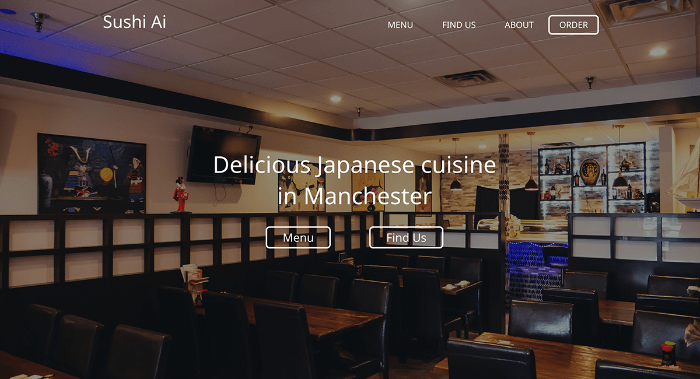

<div align="center">
    <a href="https://sushiaimanchester.com/">
        
    </a>
    <br />
    <br />
    <a href="https://sushiaimanchester.com/">
        
    </a>
    <h3 align="center">Sushi Ai Manchester</h3>
    <p align="center">Website I designed and built for a local Sushi Restaurant. Made with Typescript React. <a href="https://sushiaimanchester.com/">See it live here.</a></p>
</div>

# What's this?

This is a small website for a real restaurant for people who fancy some Japanese cuisine. The restaurant used to have an old website, but it was down for quite a while.

I always thought it was a little funny that the they had things like online delivery but other than Yelp or Google Maps you couldn't mind much more information about them. So this website just grabs all that information and connects it together.

They would get a neat little website and I would get some practice with designing and building front-end projects. Other than domain names this website practically costs nothing to run since there isn't enough online traffic to warrant significant bandwidth usage.

One big thing is that I still need to do is to integrate a Content Management System into this so the restaurant can update information as needed.

# Run it on your machine

## Requirements

- NodeJS
- Yarn Package Manager
- Git

## Instructions

1. First, let's go ahead and clone the repo.

```
git clone https://github.com/translucentleaf/sushi-ai.git
```

Step into the directory

```
cd sushi-ai
```

Install all dependencies

```
yarn install
```

Now run the project! You should see a browser window pop up. If not, go to http://localhost:3000/.

```
yarn run
```
